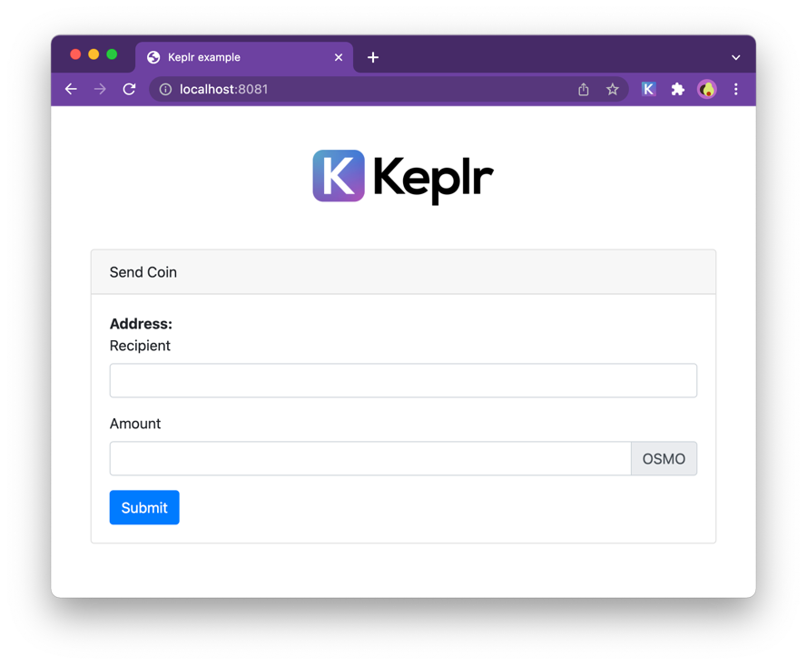

# Keplr Example
This is a simple example if how to Keplr extension injects the offline signer that is compatible with cosmJS. 


## Local Development

Install dependencies

```
npm install

```

Run development Server
```
npm run dev
```

For more details see comments on `src/main.js`.
